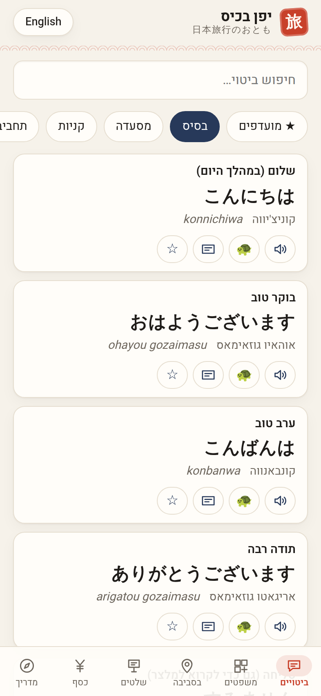
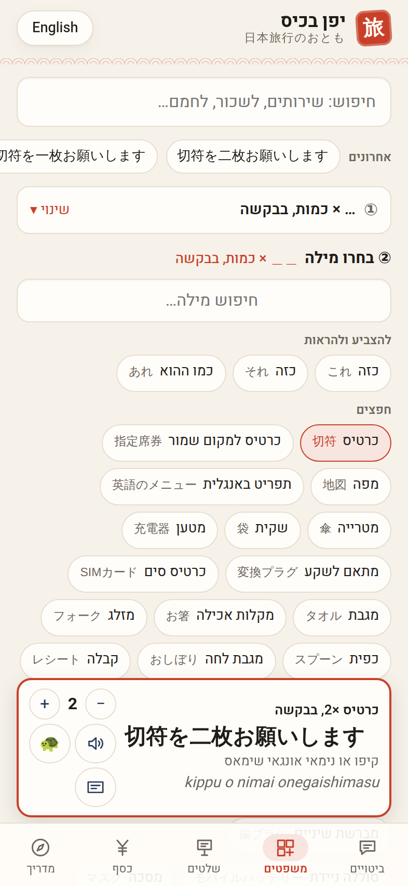
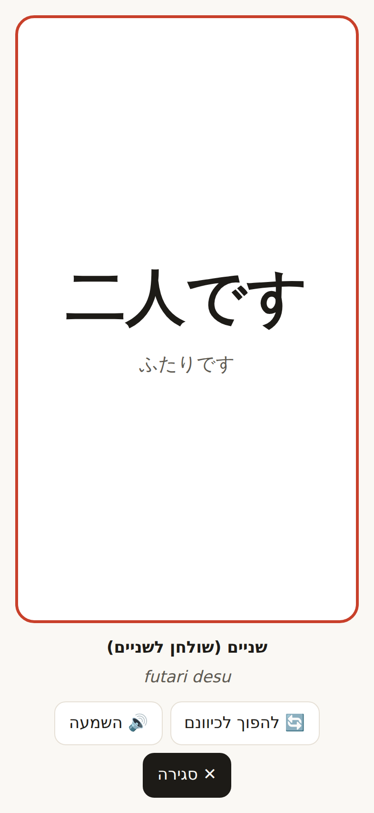
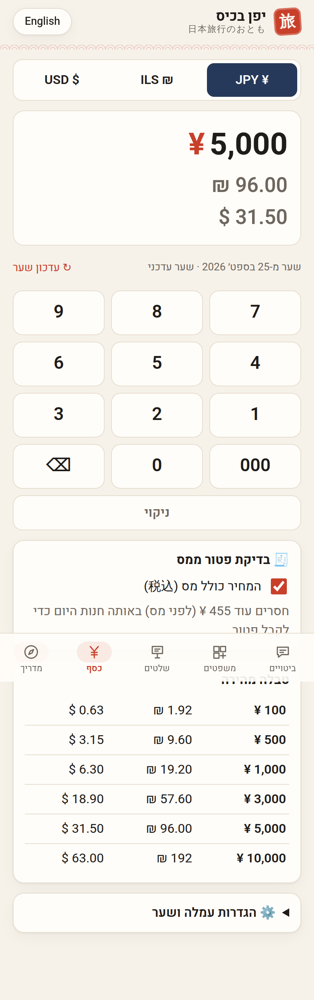
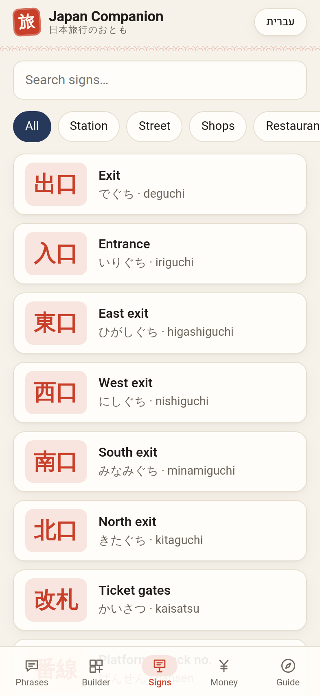

# Japan Companion (יפן בכיס)

A pocket web app for getting around Japan, built for two Hebrew speakers on
iPhones. It's a general Japan app, not tied to one route: it opens from the
home screen, works without signal, and does the two hardest things for a
visitor well.

1. **Language:** talk to people, read signs, order food.
2. **Money:** know what something costs in shekels and dollars, and handle a
   country that still runs on cash.

> **Status:** v0.8: Nearby adds konbini, 60+ searches and local apps. v0.7 added the 📍 Nearby tab (toilets and bins). v0.6: The builder only offers sensible sentences (58 frames, 3,056 hand-checked
> combinations), with long word lists folded behind "+N more". Light, modern Japanese design; 137 ready phrases; works offline.

**Live app:** https://guyyyy15-web.github.io/japan-companion/ (deployed automatically
from `main` by `.github/workflows/deploy.yml`).

> **Pages setting:** Settings → Pages → Build and deployment → **Source: GitHub Actions**.
> If it's set to "Deploy from a branch", GitHub *also* publishes this README as the site
> and the two deployments race. Whichever finishes last wins, so you sometimes get the README. On each iPhone, open it in **Safari → Share → Add to Home Screen**.

## Run it

```bash
cd app
npm install
npm run dev        # http://localhost:5173
npm test           # unit tests: money maths, i18n parity, content schema, every builder sentence
npm run lint
npm run build      # dist/ + service worker
npm run preview &  # then: npm run smoke  (iPhone-viewport browser test, writes screenshots/)
```

## What's in the app

| Tab | What it does |
|-----|--------------|
| 💬 Phrases | 137 phrases in 11 categories (incl. hobbies & collecting, beauty & skincare): Japanese, Hebrew pronunciation, romaji, 🔊 audio, ★ favorites, search. 🪧 opens a **full-screen card** to show staff, with the screen kept on and a flip-toward-them button. **👂 "They say"**: 20 phrases staff say to *you* (konbini, restaurant, station), each with what to answer. |
| 🧩 Builder | **Build your own sentence.** Type a few words in Hebrew, English or Japanese ("toilet", "לשכור אופניים", "heat") and pick a ready sentence, or choose a group (getting around / ordering / requests / problems), a frame and a word. 58 frames × 420 words and actions (3,056 sensible combinations) in five groups (getting around, ordering, **shopping**, requests, problems): is it second-hand, does it work outside Japan, discount on this, is tax included, a cheaper one, size M, most popular face lotion, OK for sensitive skin, how do I use the crane game, could you move the prize, where is, how do we get to, which platform for Kyoto, tickets ×2 to Osaka, how much is that, can I have, I'm allergic to, could you heat it up, may I take a photo, please call a doctor, the air conditioner is broken… You get correct Japanese, kana, romaji, Hebrew pronunciation, 🔊 / 🐢 audio and the show-card. See [the design](docs/05-phrase-builder.md). |
| 📍 Nearby | **Nearest public toilets, trash cans and konbini**, even offline: GPS plus a bundled OpenStreetMap snapshot. Shows distance, a direction arrow (optional live compass), the konbini chain, and walking directions in Google Maps, plus a map when online. **60+ one-tap Google Maps searches in Japanese** in four groups (essentials, food, fun, shopping), and free-text search (type ראמן, get ラーメン). **Apps locals use**: Tabelog, Hot Pepper, NAVITIME, GO taxi, ecbo cloak, autumn-leaves forecast and more. The data is refreshed monthly by `.github/workflows/refresh-facilities.yml`. |
| 🈯 Signs | 83 kanji from signs and menus (exits, push/pull, open/closed, tax-free, pork/beef, onsen curtains…), by place, searchable |
| 💴 Money | ¥ ↔ ₪ ↔ $ keypad converter, live rate cached for offline, optional card-fee % and a manual rate, a quick-reference table, and a tax-free check (≥ ¥5,000 before tax) |
| 🧭 Guide | Japanese voice settings (choose the best voice, speed, test), tap-to-call emergency numbers and the Israeli embassy, a pre-flight checklist, cash & ATMs, tax-free rules, trains & Suica, etiquette, earthquakes |

Everything is Hebrew (RTL) or English with one toggle.

| Hebrew phrases | Phrase builder | Show-card | Converter | Signs (English) |
|---|---|---|---|---|
|  |  |  |  |  |

## Claude skills for this project

`.claude/skills/` holds project skills Claude uses while building this app:

| Skill | Use |
|-------|-----|
| `japanese-phrase-content` | Schema, politeness level, Hebrew transliteration rules, and a verification checklist for every phrase/sign |
| `ios-pwa` | iPhone Safari PWA rules: install, offline, sub-path hosting, Japanese speech, wake lock, safe areas |
| `bilingual-rtl-ui` | Hebrew/English i18n and RTL: logical CSS, isolating Japanese and money, Hebrew copy tone |
| `release-check` | The pre-push routine: lint, tests, build, then an iPhone-viewport browser pass in both languages plus an offline reload |

## Documents

| # | Doc | What's in it |
|---|-----|--------------|
| 1 | [Research](docs/01-research.md) | What actually trips up visitors to Japan, with sources |
| 2 | [Product plan](docs/02-product-plan.md) | Features, what's in the MVP, extra ideas, build phases |
| 3 | [Architecture](docs/03-architecture.md) | Tech choices: offline PWA, Hebrew/English + RTL, exchange rates |
| 4 | [Open questions](docs/04-open-questions.md) | Decisions still to make together |
| 5 | [Phrase builder](docs/05-phrase-builder.md) | Why frame + word works in Japanese, the frames, research notes |
| 6 | [Nearby](docs/06-nearby.md) | Toilets and bins: data sources, offline list, map, monthly refresh |

## Decisions so far

| Topic | Decision |
|-------|----------|
| Platform | Installable web app (PWA) on iPhone, no App Store |
| UI language | Hebrew and English, with a toggle; Hebrew is right-to-left |
| Priority | Language help and money first |
| Scope | General Japan, not tied to a specific itinerary |
| Diet cards | Not needed |
| Look | Modern Japanese, light only: washi paper, sumi ink, vermilion (shu) and indigo (ai); Heebo for Hebrew/Latin, Hiragino Sans/Mincho for Japanese; line icons; hanko-stamp logo |
| Tax-free | Trip ends before Nov 1, 2026, so the **current** rules apply (discount at the till) |

## Layout

```
japan-companion/
├── .claude/skills/        project skills (see above)
├── docs/                  research, plan, architecture, open questions
├── screenshots/           output of `npm run smoke`
└── app/
    ├── public/            icons (torii), rendered by scripts/icons.mjs
    ├── scripts/           smoke.mjs (browser test), icons.mjs
    └── src/
        ├── content/       phrases.json, listening.json, signs.json, vocab.json, patterns.ts, guide.ts, content data only
        ├── i18n/          en.ts (source of keys), he.ts
        ├── lib/           money, builder, storage, speech, wake lock, search
        ├── components/    Ja, MoneyText, ShowCard, Chips, TabBar
        ├── features/      phrases, builder, signs, money, guide
        └── test/          vitest suites
```
